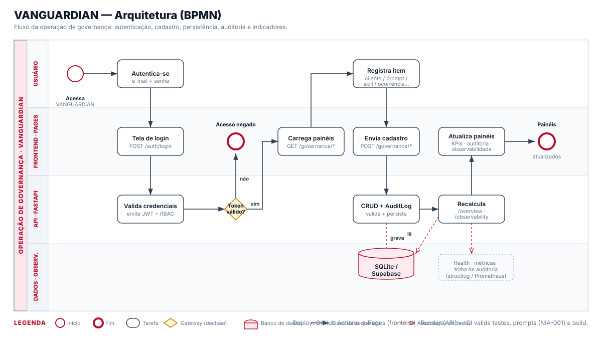

# Arquitetura — VANGUARDIAN




Visão técnica de como o repositório de prompts/PI e a plataforma de governança se
articulam.

## Componentes

```
┌────────────────────────────────────────────────────────────┐
│                        VANGUARDIAN                           │
├──────────────┬───────────────────────┬─────────────────────┤
│  prompts/    │      frontend/        │      backend/        │
│  (fonte da   │  Protótipo estático   │  API FastAPI         │
│   verdade    │  (dashboard, módulos, │  (auth, admin,       │
│   de PI —    │   biblioteca, login)  │   prompts, skills,   │
│   arquivos)  │                       │   tools, integrações)│
└──────────────┴───────────────────────┴─────────────────────┘
        │                 │                        │
   git = trilha      JWT + API REST          SQLite (dev) /
   de auditoria      (Authorization)         PostgreSQL (prod)
```

## Fonte da verdade dos prompts

Os prompts vivem primariamente como **arquivos versionados** em [`../prompts/`](../prompts/).
A biblioteca da API (`Prompt` em [`../backend/models.py`](../backend/models.py)) e a UI
consomem/refletem esse acervo. Assim garantimos:

- Versionamento e diff por `git` (cadeia de custódia de PI).
- Revisão via Pull Request antes de produção.
- Portabilidade: o acervo não depende de um banco específico.

## Camadas do backend

| Camada | Pasta | Função |
|--------|-------|--------|
| Auth | `auth/` | JWT, RBAC, dependências |
| Domínio | `routes_*.py`, `crud.py`, `models.py`, `schemas.py` | Prompts, skills, tools, users |
| Admin | `admin/` | Gestão, auditoria, métricas |
| Integrações | `integrations/` | RD Station, ICLIPS, VJOB |
| Observabilidade | `observability/` | Health, logs, métricas Prometheus |

## Fluxo de dados de um prompt homologado

1. Autor cria arquivo em `prompts/<area>/` (status `rascunho`).
2. PR revisado e homologado por Manager/Admin.
3. Merge → índice do catálogo atualizado.
4. Prompt disponível para consumo pela UI/API, com metadados de governança.

## Deploy

- **Backend**: Render (`render.yaml`) ou Docker (`Dockerfile`).
- **Banco de dados**: SQLite (dev) / **Supabase PostgreSQL** (prod) — provisionado
  como **infra externa**, conectado via `DATABASE_URL`. Ver [`SUPABASE.md`](SUPABASE.md).
- **Frontend**: protótipo HTML estático autocontido, publicado no GitHub Pages
  (workflow `deploy-frontend-pages.yml`, sem etapa de build).
