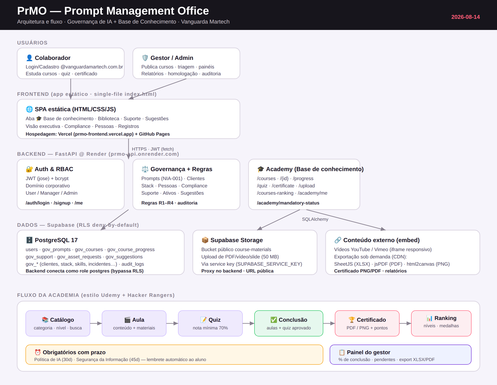

# Relatório do dia — 2026-08-14

**Projeto:** PrMO — Prompt Management Office · Vanguarda Martech
**Tema do dia:** Base de Conhecimento (capacitação estilo Udemy + gamificação Hacker Rangers) e ajustes de conteúdo
**Branch:** `claude/prompts-repo-infrastructure-08dmf1`

---

## 1. Tarefas solicitadas × entregues

| # | Tarefa solicitada (pelo usuário) | Entregue | Status |
|---|----------------------------------|----------|:------:|
| 1 | "Crie uma aba base de conhecimento parecida com a Udemy, para treinamentos e cursos de IA, compliance e segurança da informação." | Aba **🎓 Base de conhecimento**: catálogo por categoria, filtros, busca, cards com progresso, modal do curso com aulas marcáveis e trilho "Continue de onde parou". 6 cursos iniciais. | ✅ |
| 2 | "Desenvolva cursos obrigatórios com prazo, emissão de certificado ao concluir e quiz com nota, estilo Hacker Rangers." | Obrigatórios com **prazo**, **quiz com nota** (gate de conclusão), **certificado** imprimível e **ranking** por pontos. | ✅ |
| 3 | "Badges/níveis por pontuação, painel do gestor com quem está pendente nos treinamentos obrigatórios, ou lembrete automático de prazo." | **Níveis** (Aprendiz→Platina) + **medalhas**; **painel do gestor** de obrigatórios (% conclusão + pendentes); **lembrete automático** de prazo (banner in-app). | ✅ |
| 4 | "Exportar o relatório de conclusão dos obrigatórios (PDF/XLSX) … certificado com download em PNG." | Relatório de obrigatórios em **XLSX** (Resumo + Pendentes) e **PDF**; certificado com **download PNG** além de imprimir/PDF. | ✅ |
| 5 | "Preciso incluir cursos com materiais anexos … campos para anexar materiais e vídeos." | Campo **Materiais** por curso; **vídeos YouTube/Vimeo incorporados** e docs por botão (opção escolhida: por link/incorporado). | ✅ |
| 6 | "Sim" (preparar **upload real** de arquivos). | Bucket `course-materials` no **Supabase Storage** + endpoint `POST /courses/upload` + botão **⬆ Enviar arquivo**. Requer 2 variáveis no Render para ativar. | ✅ (ativação pendente do usuário) |
| 7 | "Popule a base de conhecimento conforme os anexos, e com os quiz que estão no final de cada PDF." | Os 5 treinamentos populados com **4 aulas de conteúdo** + o **quiz oficial de 5 questões** de cada PDF (gabarito correto, nota mínima 70%). | ✅ |
| 8 | "Nenhuma tem o conteúdo … vídeo em inglês … guia redirecionando … ajuste toda a base." + "sem material também" | **Removidos os materiais-placeholder** de toda a base; **"Fundamentos de IA Generativa"** ganhou conteúdo nas 4 aulas. Estado final: 6 cursos, 4 aulas com conteúdo, **0 materiais**. | ✅ |
| 9 | "Documente o dia de hoje." | Diário de sessão 11 consolidado + este relatório + diagrama de arquitetura. | ✅ |

---

## 2. Detalhamento técnico

### Backend (FastAPI · `backend/governance.py`, `config.py`)
- Modelos **`Course`** (`gov_courses`) e **`CourseProgress`** (`gov_course_progress`), com campos de gamificação: `mandatory`, `due_date`, `points`, `pass_score`, `quiz`, `materials`; e por aluno: `quiz_score`, `quiz_passed`, `certificate_code`, `completed_at`. Aula com campo `content`.
- Endpoints: `GET /governance/courses` (filtros categoria/nível/busca), `/courses/mine`, `/courses/{id}`, `POST /courses` e `PUT /courses/{id}` (gestor, regra R1 + categoria válida), `POST /courses/{id}/progress`, `POST /courses/{id}/quiz` (correção + nota), `GET /courses/{id}/certificate`, `POST /courses/upload` (Supabase Storage), `GET /courses-ranking`, `GET /academy/me` (nível, medalhas, lembretes), `GET /academy/mandatory-status` (painel do gestor).
- Conclusão exige **todas as aulas** e, havendo quiz, **aprovação ≥ nota mínima**; ao concluir, emite certificado e pontua. O **gabarito do quiz nunca é exposto** pela API.

### Frontend (`frontend/index.html`)
- Aba Academy: cards com selo "Obrigatório", chip de prazo (no prazo / vence em Nd / atrasado) e pontos; modal com aulas expansíveis ("toque para ler"), materiais (vídeo embutido / botão), quiz e certificado.
- Card "Meu progresso" (nível + barra + medalhas), painel "🏆 Ranking", painel do gestor com % e pendentes, banner de lembretes, exportações (XLSX/PDF/PNG), formulário de novo curso (obrigatoriedade, prazo, pontos, nota, aulas, quiz, materiais, upload).

### Dados (Supabase · RLS deny-by-default)
- Novas colunas em `gov_courses` e `gov_course_progress` (com RLS); bucket público `course-materials` no Storage.
- 6 cursos semeados; os 5 dos PDFs com conteúdo oficial e quizzes reais.

---

## 3. Produção (no ar)

| Camada | Endereço |
|--------|----------|
| Frontend (Vercel) | https://prmo-frontend.vercel.app |
| Frontend (GitHub Pages) | https://jussaracavalcante-sketch.github.io/Governan-a_vanguarda/ |
| Backend (Render) | https://prmo-api.onrender.com |
| Banco / Storage | Supabase `prmo-governanca` (ref `ubixfcoigwpjdrioymdq`) |

---

## 4. Validações
- **TestClient** (backend): catálogo, progresso, gating quiz→conclusão→certificado, ranking, níveis, medalhas, painel do gestor, RBAC 403, regra R1, upload 503/403, conteúdo em todas as aulas.
- **Playwright** (UI, `file://` + mock/stubs): base 14/14, gamificação 13/13, engajamento 13/13, exportação 10/10, materiais 8/8, upload, conteúdo de aula 5/5.

---

## 5. Pendências (ação do usuário)
1. **Render** — ativar upload de arquivos: `SUPABASE_URL=https://ubixfcoigwpjdrioymdq.supabase.co` e `SUPABASE_SERVICE_KEY=<service_role>` em `prmo-api`.
2. **Vercel** — definir Production Branch = `claude/prompts-repo-infrastructure-08dmf1` (Settings → Git) para deploy automático.
3. **Revogar o token da Vercel** usado nas sincronizações.
4. *Opcional* — envio de lembrete/relatório por e-mail (SMTP: Resend/SendGrid/SES).

---

## 6. Arquitetura e fluxo

*Diagrama: `docs/arquitetura-prmo.svg` (fonte) e `docs/arquitetura-prmo.png` (imagem).*
